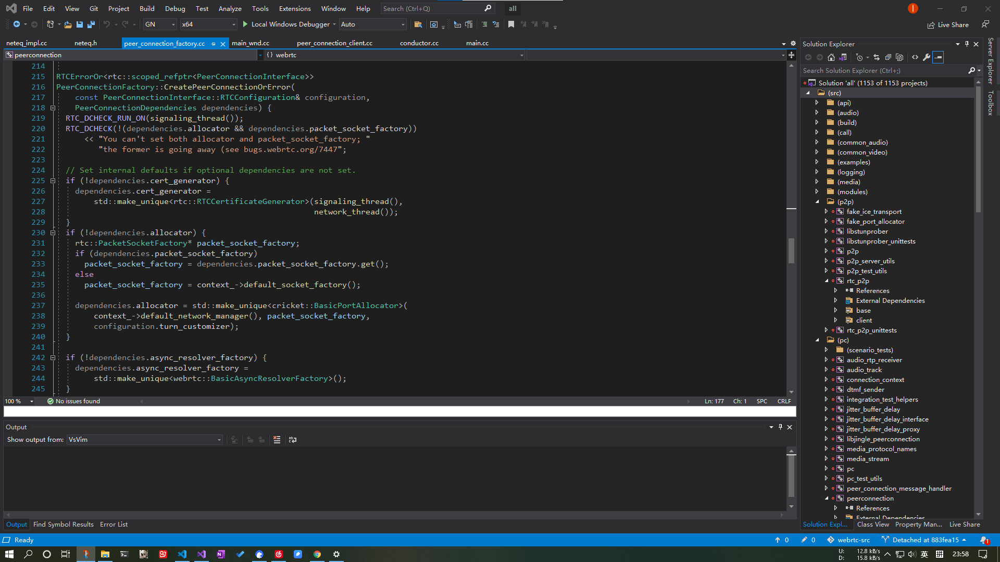
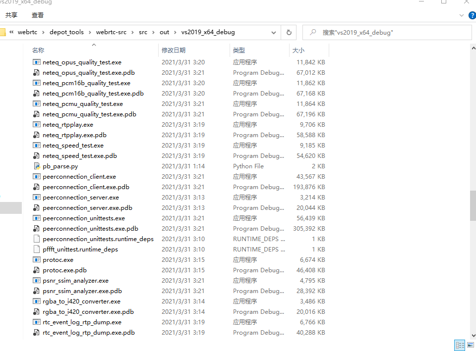
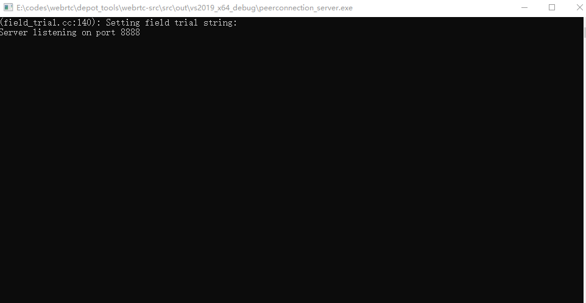
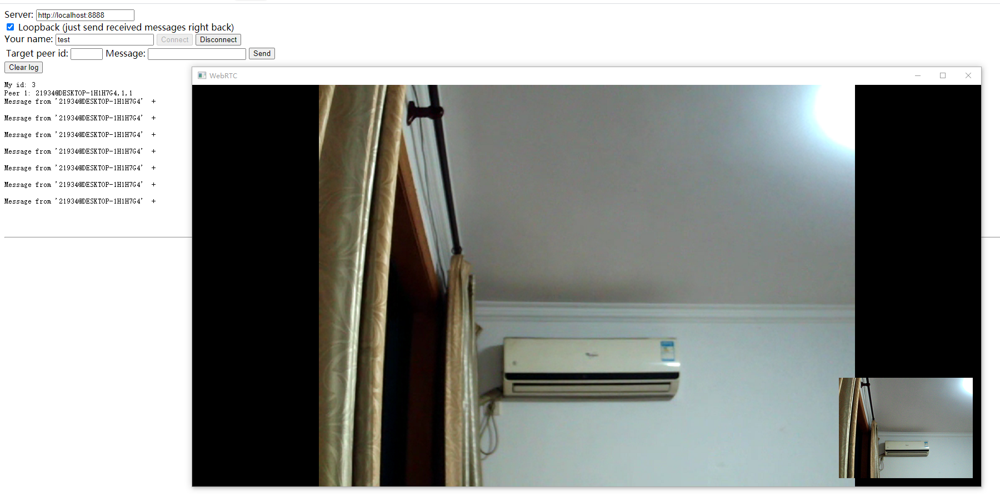

# WebRTC 源码编译

> 请确保你能够访问google等外网环境

## 常用网站

- [官网](https://webrtc.org/)
- [WebRTC接口文档MDN](https://developer.mozilla.org/en-US/docs/Glossary/WebRTC)
- [WebRTC中文网(声网运营)](https://webrtc.org.cn/)
- [WebRTC native code](https://webrtc.googlesource.com/src/+/refs/heads/master/docs/native-code/index.md)

## Windows 平台编译

### 工具链

- VS2019, 可以选择免费的社区版
    - Desktop development with c++组件使用10.0.18362或以上版本
    - 安装调试工具Debugging Tools for Windows
- depot_tools，用于管理WebRTC代码仓库
    - `git clone https://chromium.googlesource.com/chromium/tools/depot_tools.git`
    - 将上述`depot_tools`目录添加到系统环境变量里面，后面步骤会使用该目录下的脚本
    - 添加一个名为`DEPOT_TOOLS_WIN_TOOLCHAIN`的环境变量，值为0，提示depot_tools使用本机的VS进行编译
    - 在cmd窗口运行`gclient`，会自动下载git和python等依赖

### 拉取代码仓库

```shell
mkdir -p c:\workspace\webrtc
cd c:\workspace\webrtc

fetch --nohooks webrtc
gclient sync
```

代码仓库比较大，该过程比较耗时

### 编译

指定编译环境：
```shell
set DEPOT_TOOLS_WIN_TOOLCHAIN=0
set GYP_MSVS_VERSION=2019
set vs2019_install=C:\Program Files (x86)\Microsoft Visual Studio\2019\Enterprise
set GYP_MSVS_OVERRIDE_PATH=C:\Program Files (x86)\Microsoft Visual Studio\2019\Enterprise
set GYP_GENERATORS=msvs-ninja,ninja
```

生成工程文件：
```shell
cd c:\workspace\webrtc\src
gn gen --ide=vs out/Default2019
# gn gen out/vs2019_x64_debug  --ide=vs --args="target_cpu=x64  is_debug=true"
```
生成的工程文件(.sln)可以用VS2019打开：


编译：
```shell
ninja -C  out/Default2019
```

编译完成后，会在目录`out/Default2019`下生成exe文件：


### demo运行

编译完成后会生成peerconnection demo，该demo可以实现双向音视频通话

首先运行`peerconnection_server.exe`，该程序作为一个信令服务器，用来同步所有客户端的状态：


然后运行一个web客户端实例`src/examples/peerconnection/server/server_test.html`和一个windows客户端实例`peerconnection_client.exe`，并连接上peerconnection_server，windows客户端能看到web端的实例，选中web端后输入回车便可以和web端进行实时音视频通话：


## 参考文档

- https://blog.csdn.net/Dreamandpassion/article/details/108271894
- https://webrtc.googlesource.com/src/+/refs/heads/master/docs/native-code/development/prerequisite-sw/index.md
- https://webrtc.googlesource.com/src/+/refs/heads/master/docs/native-code/development/index.md

到此，你已经成功编译webrtc代码并运行demo，接下来便可进入源码的学习了。